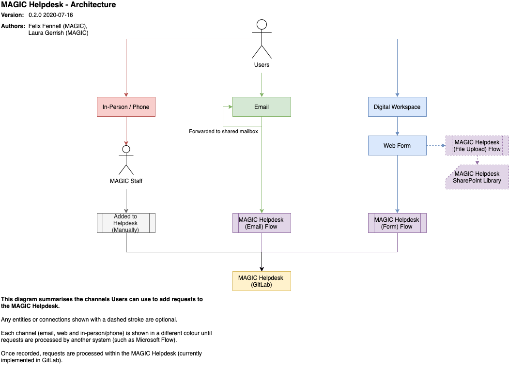

# MAGIC Helpdesk Implementation

This project documents how the MAGIC Helpdesk is implemented and manages the online web form used by users.

See the main [MAGIC Helpdesk](https://gitlab.data.bas.ac.uk/MAGIC/general-and-helpdesk) project for the actual MAGIC
Helpdesk.

## Usage

Users can submit a request to the MAGIC helpdesk via a [Supported communication channel](#supported-channels):

* online, by using the web form at [magic-helpdesk.web.bas.ac.uk](https://magic-helpdesk.web.bas.ac.uk)
* email, by contacting [magic@bas.ac.uk](mailto:magic@bas.ac.uk)
* in-person/phone, by contacting a member of MAGIC who will submit a request on their behalf if needed

In all cases, submitted requests are added as GitLab issues in the
[MAGIC Helpdesk](https://gitlab.data.bas.ac.uk/MAGIC/general-and-helpdesk) project.

## Implementation

The MAGIC Helpdesk is designed to be a simple, low maintenance and highly available service.

In a general sense, requests are captured through a [Supported communication channel](#supported-channels) and turned
into a GitLab issue using the [Data model mapping](#data-model-mapping).

More specifically, various Power Automate Flows are used as the backend of the MAGIC Helpdesk, responding to incoming
requests from a communications channel and processing them into an issue for submission through GitLab's issue API.

Where possible, the Microsoft 365 ecosystem is used as it is:

* officially supported by BAS/NERC IT
* pre-approved for processing UKRI information
* avoids single points of failure

### Availability

The MAGIC Helpdesk is intentionally not restricted to the BAS network to allow project partners and other relevant
parties to submit requests alongside BAS staff.

### Supported channels



#### Email

##### Emails to MAGIC shared mailbox

New emails sent to this mailbox trigger a Microsoft Power Automate Flow,
[MAGIC Helpdesk (emails)](https://emea.flow.microsoft.com/manage/environments/Default-b311db95-32ad-438f-a101-7ba061712a4e/flows/shared/72b16e9e-f864-4596-a695-484b7aa2eec0/details).

If attachments are included in an email, an instruction is added to the helpdesk request for users to refer to the original email in OutLook.

Processed emails are marked as read in the shared mailbox.

**Note:** Basic filtering is used to exclude spam reports and other erroneous emails from being processed.

##### Emails to MAGIC staff

If MAGIC staff are emailed directly, and the email is a Helpdesk request, the staff member will forward the message to
the MAGIC shared mailbox for processing as a Helpdesk request.

#### Online

##### BAS Digital Workspace

The BAS Digital Workspace includes [a page](https://geo.web.bas.ac.uk/helpdesk/home) directing users to create Helpdesk
requests via a web form.

This ensures users can find the MAGIC Helpdesk within the Digital Workspace search and site wide navigation.

##### Web form

Requests submitted through the online web form trigger a Microsoft Power Automate Flow,
[MAGIC Helpdesk (web form)](https://emea.flow.microsoft.com/manage/environments/Default-b311db95-32ad-438f-a101-7ba061712a4e/flows/d84b9a44-8b3c-465b-96d3-c95af6ad4c4c/details).

Attachments added to the online form trigger a separate Power Automate Flow,
[MAGIC Helpdesk (file upload)](https://emea.flow.microsoft.com/manage/environments/Default-b311db95-32ad-438f-a101-7ba061712a4e/flows/84e5c72c-655b-4c11-8c4a-73bc9b52b931/details),
which will save the file to a SharePoint document library. The web form will include attachment information in the
request sent to create the helpdesk request.

Multiple files can be attached, each with a maximum size of 100MB (set by Power Automate).

#### In-person/Phone

If a user phones a MAGIC staff member or speaks to them in person, and the conversation should be processed as a
helpdesk request, the staff member will transcribe/record the request as a GitLab issue in the Helpdesk manually.

If the request is very simple (such as providing a pre-printed map) it may not be recorded as a request for efficiency
reasons.

### Components

**Note:** See the [Supported channels](#supported-channels) section for how these components are used together to
capture and process requests.

#### MAGIC shared mailbox

A Microsoft Office 365 / Exchange shared mailbox assigned to MAGIC available at these addresses:

* `basmagic@bas.ac.uk` (primary name)
* `magic@bas.ac.uk` (alias name, preferred)

This mailbox is owned by Adrian and administered by Laura and others that monitor the MAGIC Helpdesk.

#### BAS Digital Workspace

A Microsoft SharePoint intranet for use by BAS staff. It provides a range of functions but within the context of this
project provides:

* links to internal services, such as helpdesk's
* team information pages, including any services they offer

This intranet is owned by BAS communications with some editing permissions delegated to local editors (Elena for MAGIC).

#### Online web form

A external web form used as an online interface for users to submit requests into the MAGIC Helpdesk.

This form is hosted as an AWS S3 static site managed through this project.

#### Microsoft SharePoint

A document management and information sharing platform within Office 365.

It consists of sites containing lists, document libraries and pages. Within the context of this project, SharePoint is
used for storing attachments for requests made via the online web form. Attachments are stored in a document library.

#### Microsoft Power Automate

Previously known as Microsoft Flow, a business and workflow automation platform within Office 365.

It consists of a trigger (e.g. new email received) and actions (e.g. submitting a HTTP request). Power Automate
tracks executions and allows the inputs/outputs of each instance to be viewed for debugging. Flows can be shared with a
group to remove having a single owner.

Power Automate includes many actions relating to other Microsoft services, such as SharePoint or Exchange and masks the
technical details of how to connect, authenticate and use them. It also supports generic actions such as making HTTP
requests, which is used for communicating with GitLab for example.

Power Automate is effectively the backend of the MAGIC Helpdesk, responding to incoming requests from a communications
channel and processing them into an issue that can be submitted through GitLab's issue API.

#### GitLab

Specifically the self-hosted BAS instance. GitLab is used across MAGIC for project management and is used for the MAGIC
Helpdesk.

### Data model

#### Requests

Helpdesk requests are simple objects with these properties:

| Property       | Data Type                                            | Required | Description                         | Example                                   |
| -------------- | ---------------------------------------------------- | -------- | ----------------------------------- | ----------------------------------------- |
| `content`      | String                                               | Yes      | Request description                 | *I would like a map of the attached AOI.* |
| `sender-name`  | String                                               | Yes      | Name of the requester               | *Connie Watson*                           |
| `sender-email` | String                                               | Yes      | Email address of the requester      | *conwat@bas.ac.uk*                        |
| `attachments`  | Array of [Request attachments](#request-attachments) | No       | File attachments related to request | -                                         |

**Note:** This is an abstract model and is [mapped](#data-model-mappings) to a real implementation.

#### Request attachments

Request attachments are simple objects with these properties:

| Property | Data Type | Required | Description                    | Example                        |
| -------- | --------- | -------- | ------------------------------ | ------------------------------ |
| `name`   | String    | Yes      | Filename of attachment         | *aoi.gpkg*                     |
| `url`    | String    | Yes      | URL to download the attachment | *https://example.com/aoi.gpkg* |

**Note:** This is an abstract model and is [mapped](#data-model-mappings) to a real implementation.

#### Data model mappings

Abstract data models needed to mapped to an implementation to be used. Multiple implementations may be used as data
passes through different systems.

| Data Model          | Property       | Web Form       | Web Form (Notes) | Email                | Email (Notes)                 | GitLab Issues     | GitLab Issues (Notes)                                       |
| ------------------- | -------------- | -------------- | ---------------- | -------------------- | ----------------------------- | ----------------- | ----------------------------------------------------------- |
| Requests            | `content`      | `content`      | Direct mapping   | Email body           | Direct mapping                | Issue description | Direct mapping                                              |
| Requests            | `sender-name`  | `sender-name`  | Direct mapping   | Email sender name    | Parsed from email sender      | Issue description | All issues are created as the BAS Feedback Service Bot user |
| Requests            | `sender-email` | `sender-email` | Direct mapping   | Email sender address | Parsed from email sender      | Issue description | All issues are created as the BAS Feedback Service Bot user |
| Requests            | `attachments`  | `attachments`  | Direct mapping   | Email attachments    | Parsed from email attachments | Issue description | Attachments are added inline within the issue description   |
| Request attachments | `name`         | `name`         | Direct mapping   | Email attachment     | May not be directly exposed   | Issue description | Attachments are added inline within the issue description   |
| Request attachments | `url`          | `url`          | Direct mapping   | Email attachment     | May not be directly exposed   | Issue description | Attachments are added inline within the issue description   |

## Setup

This project runs as a static website.

### Terraform

Terraform is used to provision resources required for the static website.

Access to the [BAS AWS account](https://gitlab.data.bas.ac.uk/WSF/bas-aws) is needed to provisioning these resources.

**Note:** This provisioning should have already been performed (and applies globally). If changes are made to this
provisioning it only needs to be applied once.

```shell
# start terraform inside a docker container
$ cd provisioning/terraform
$ docker-compose run terraform
# setup terraform
$ terraform init
# apply changes
$ terraform validate
$ terraform fmt
$ terraform apply
# exit container
$ exit
$ docker-compose down
```

#### Terraform remote state

State information for this project is stored remotely using a
[Backend](https://www.terraform.io/docs/backends/index.html).

Specifically the [AWS S3](https://www.terraform.io/docs/backends/types/s3.html) backend as part of the
[BAS Terraform Remote State](https://gitlab.data.bas.ac.uk/WSF/terraform-remote-state) project.

Remote state storage will be automatically initialised when running `terraform init`. Any changes to remote state will
be automatically saved to the remote backend, there is no need to push or pull changes.

##### Remote state authentication

Permission to read and/or write remote state information for this project is restricted to authorised users. Contact
the [BAS Mapping and Geographic Information Centre (MAGIC)](mailto:servicedesk@bas.ac.uk) to request access.

See the [BAS Terraform Remote State](https://gitlab.data.bas.ac.uk/WSF/terraform-remote-state) project for how these
permissions to remote state are enforced.

## Development

```shell
$ git clone https://gitlab.data.bas.ac.uk/MAGIC/helpdesk-implementation
$ cd helpdesk-implementation
```

### Development environment

A local instance of this project can be ran using the Docker Compose:

```shell
$ docker-compose up
```

This will run a local Nginx webserver available at `http://localhost:9000`.

## Deployment

### Continuous Deployment

All commits will trigger a Continuous Deployment process using GitLab's CI/CD platform, configured in `.gitlab-ci.yml`.

## Release procedure

For all releases:

1. create a release branch
2. close release in `CHANGELOG.md`
3. push changes, merge the release branch into `master` and tag with version

## Feedback

The maintainer of this project is the BAS Mapping and Geographic Information Centre (MAGIC), they can be contacted at:
[servicedesk@bas.ac.uk](mailto:servicedesk@bas.ac.uk).

## Issue tracking

This project uses issue tracking, see the
[Issue tracker](https://gitlab.data.bas.ac.uk/MAGIC/helpdesk-implementation/issues) for more information.

**Note:** Read & write access to this issue tracker is restricted. Contact the project maintainer to request access.

## License

© UK Research and Innovation (UKRI), 2019 - 2020, British Antarctic Survey.

You may use and re-use this software and associated documentation files free of charge in any format or medium, under
the terms of the Open Government Licence v3.0.

You may obtain a copy of the Open Government Licence at http://www.nationalarchives.gov.uk/doc/open-government-licence/
